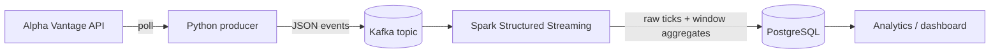

# Real-Time Stock Market Pipeline

A streaming data pipeline that ingests stock prices from a public market data
API, processes them in real time and stores the results for analytics.

Data engineering learning project and part of an application portfolio.

> **Status:** work in progress. This README describes the target design;
> components are added step by step and the sections below are updated as
> they land.

## What this project builds

- Continuous ingestion of stock prices from the
  [Alpha Vantage API](https://www.alphavantage.co)
- A Kafka topic as a buffer between ingestion and processing
- A Spark Structured Streaming job that computes windowed metrics
  (e.g. moving averages, min/max, volume per time window)
- Persistence of raw ticks and aggregated metrics in PostgreSQL for
  downstream analytics

## Learning goals

- Event streaming with Kafka (producers, topics, partitions, consumers)
- Spark Structured Streaming (micro-batches, checkpoints, watermarks)
- Window operations on event-time data (tumbling and sliding windows)
- Real-time analytics on top of a relational sink

## Architecture



| Stage | Technology | Responsibility |
| --- | --- | --- |
| Source | Alpha Vantage REST API | Intraday stock prices |
| Ingestion | Python producer | Polls the API and publishes one event per price record |
| Transport | Apache Kafka | Decouples ingestion from processing, buffers events |
| Processing | Spark Structured Streaming | Parses events, applies event-time windows and aggregations |
| Storage | PostgreSQL | Stores raw ticks and windowed metrics |

## Data source

[Alpha Vantage](https://www.alphavantage.co) provides free stock market data
via REST. A free API key is required. The free tier is rate-limited, so the
producer polls a small set of symbols at a conservative interval; check the
current limits on the Alpha Vantage website.

The API key is read from the environment variable `ALPHAVANTAGE_API_KEY` and
is never committed to the repository.

## Planned repository structure

```
.
├── producer/        # Python producer: Alpha Vantage -> Kafka
├── streaming/       # Spark Structured Streaming job: Kafka -> PostgreSQL
├── sql/             # PostgreSQL schema
├── tests/           # Unit tests
├── docker-compose.yml
└── README.md
```

## Getting started

Setup instructions follow once the first components are implemented. The
target is a local stack started with Docker Compose (Kafka, Spark,
PostgreSQL) plus the producer.

## Roadmap

- [ ] Local infrastructure with Docker Compose (Kafka, PostgreSQL, Spark)
- [ ] Producer: poll Alpha Vantage and publish events to Kafka
- [ ] Streaming job: consume events and write raw ticks to PostgreSQL
- [ ] Window operations: aggregated metrics per symbol and time window
- [ ] Tests and CI (`black`, `ruff`, `pytest`)
- [ ] Analytics layer / dashboard on top of PostgreSQL

## Credits

Project idea based on the overview "7 Free Data Engineering Projects"
by Nishant Kumar.
