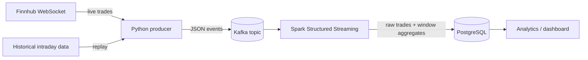

# Real-Time Stock Market Pipeline

A streaming data pipeline that ingests stock trades in real time, processes
them with windowed aggregations and stores the results for analytics.

Data engineering learning project and part of an application portfolio.

> **Status:** work in progress. This README describes the target design;
> components are added step by step and the sections below are updated as
> they land.

## What this project builds

- Real-time ingestion of US stock trades via the
  [Finnhub](https://finnhub.io) WebSocket API
- A replay mode that streams historical intraday data into the pipeline,
  independent of API limits and market hours
- A Kafka topic as a buffer between ingestion and processing
- A Spark Structured Streaming job that computes windowed metrics
  (e.g. moving averages, min/max, volume per time window)
- Persistence of raw trades and aggregated metrics in PostgreSQL for
  downstream analytics

The whole stack runs locally with Docker Compose and uses only free,
open-source components and free API tiers.

## Learning goals

- Event streaming with Kafka (producers, topics, partitions, consumers)
- Spark Structured Streaming (micro-batches, checkpoints, watermarks)
- Window operations on event-time data (tumbling and sliding windows)
- Real-time analytics on top of a relational sink

## Architecture



| Stage | Technology | Responsibility |
| --- | --- | --- |
| Source (live) | Finnhub WebSocket API | Real-time trades for US stocks |
| Source (replay) | Historical intraday data | Reproducible stream for tests and demos |
| Ingestion | Python producer | Publishes one event per trade, same schema for both sources |
| Transport | Apache Kafka | Decouples ingestion from processing, buffers events |
| Processing | Spark Structured Streaming | Parses events, applies event-time windows and aggregations |
| Storage | PostgreSQL | Stores raw trades and windowed metrics |

Both sources feed the same Kafka topic with the same event schema, so the
streaming job does not need to know where the data comes from.

## Data storage

- **PostgreSQL** is the persistent store: raw trades and windowed
  aggregates per symbol.
- **Kafka** retains events only temporarily (retention period) and acts as
  a buffer, not as long-term storage.
- **Spark checkpoints** store streaming progress so the job can resume after
  a restart.

## Data sources

**Live: Finnhub.** Finnhub offers a free tier with a WebSocket endpoint that
pushes trades for US stocks as they happen. A free API key is required.
Trades only arrive during US market hours.

**Replay: historical intraday data.** Historical intraday prices are
downloaded once and replayed into Kafka at a configurable speed. This
provides a steady stream outside market hours and makes tests and demos
reproducible.

API keys are read from environment variables (e.g. `FINNHUB_API_KEY`) and
are never committed to the repository. Free-tier limits change over time;
check the current terms on the provider's website.

## Planned repository structure

```
.
├── producer/        # Python producer: Finnhub / replay -> Kafka
├── streaming/       # Spark Structured Streaming job: Kafka -> PostgreSQL
├── sql/             # PostgreSQL schema
├── tests/           # Unit tests
├── docker-compose.yml
└── README.md
```

## Getting started

Setup instructions follow once the first components are implemented. The
target is a local stack started with Docker Compose (Kafka, Spark,
PostgreSQL) plus the producer. Running all services at once needs roughly
8 GB of RAM; 16 GB is comfortable.

## Roadmap

- [ ] Local infrastructure with Docker Compose (Kafka, PostgreSQL, Spark)
- [ ] Producer, replay mode: stream historical intraday data into Kafka
- [ ] Producer, live mode: Finnhub WebSocket into Kafka
- [ ] Streaming job: consume events and write raw trades to PostgreSQL
- [ ] Window operations: aggregated metrics per symbol and time window
- [ ] Tests and CI (`black`, `ruff`, `pytest`)
- [ ] Analytics layer / dashboard on top of PostgreSQL

## Credits

Project idea based on the overview "7 Free Data Engineering Projects"
by Nishant Kumar, which proposes Alpha Vantage as data source. This project
uses Finnhub instead because its free tier provides a real-time stream.
